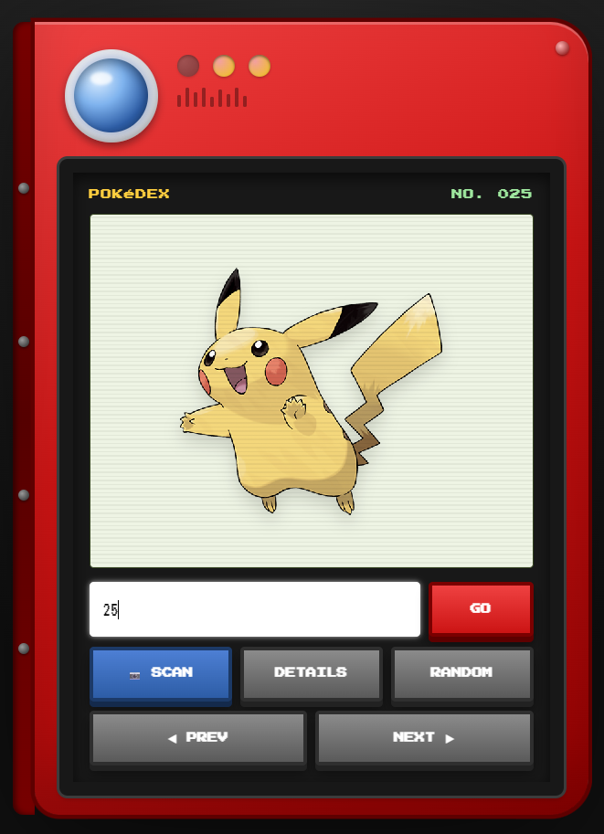
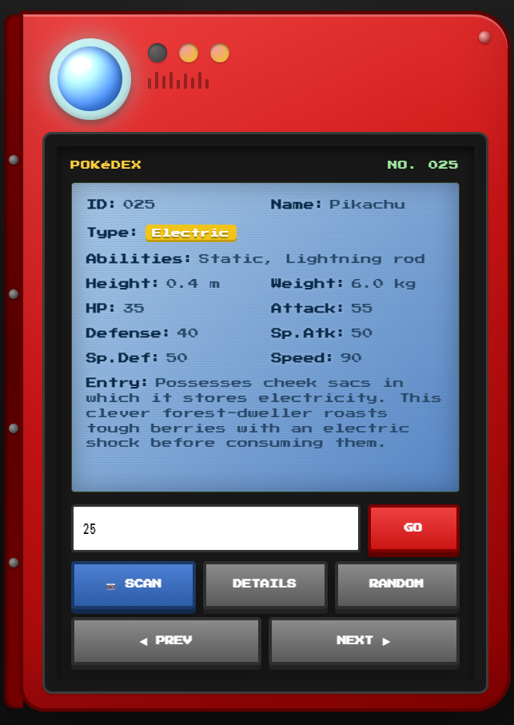
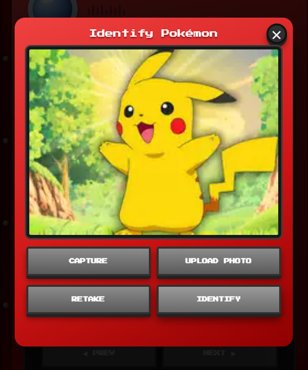

# 🔴 Pokédex

A modern, interactive Pokédex built with **HTML, CSS, and JavaScript** that combines the nostalgic look of the original Pokédex with modern web technologies.

Search Pokémon by name or Pokédex number, hear authentic cries, read official Pokédex entries, navigate through every Pokémon, and even identify Pokémon from photos using AI—all directly in your browser.

---

## ✨ Features

### 📖 Complete Pokédex
- Search Pokémon by **name** or **ID**
- Supports **Generation I–IX** (Pokémon #1–1025)
- Smart handling of Pokémon with multiple forms (Deoxys, Giratina, Shaymin, etc.)

### 🎵 Authentic Pokémon Cries
- Plays official Pokémon cries
- Multiple fallback sources for maximum compatibility
- Animated speaker while audio is playing

### 📚 Official Pokédex Entries
- Fetches live Pokédex descriptions from the PokéAPI Species endpoint
- Automatically falls back to local descriptions when unavailable

### 📷 AI Pokémon Scanner
Identify Pokémon using your camera or an uploaded image.

- Camera capture
- Image upload
- AI-powered image classification
- Automatic Pokédex lookup after recognition

### 🎮 Interactive Pokédex UI
- Retro Pokédex design
- Animated boot screen
- Flip card animation for details
- LED status indicators
- Responsive layout
- Sound effects
- Pixel-style interface

### 🔍 Detailed Pokémon Information

View:

- Name
- National Dex Number
- Types
- Abilities
- Height
- Weight
- HP
- Attack
- Defense
- Special Attack
- Special Defense
- Speed
- Official Pokédex entry

### 🔊 Text-to-Speech

The Pokédex can read the current Pokémon's Pokédex entry aloud using the browser's Speech Synthesis API.

---

# Demo

<table align="center">
  <tr>
    <td align="center">
      <br>
      <b>Main Screen</b>
    </td>
    <td align="center">
      <br>
      <b>Details View</b>
    </td>
    <td align="center">
      <br>
      <b>AI Scanner</b>
    </td>
  </tr>
</table>

---

# Technologies Used

- HTML5
- CSS3
- Vanilla JavaScript
- PokéAPI
- Transformers.js
- Hugging Face ONNX Model
- Web Speech API
- MediaDevices Camera API

---

# APIs

### PokéAPI

Used for:

- Pokémon data
- Official artwork
- Stats
- Types
- Abilities
- Pokédex entries

https://pokeapi.co/

---

### Pokémon Showdown

Used for Pokémon cries.

https://play.pokemonshowdown.com/

---

### Hugging Face

Used for AI Pokémon image recognition.

https://huggingface.co/

---

# AI Model

Image recognition is powered by:

**ash-ketchum-37884/pokemon-classifier-onnx**

Running entirely inside the browser using **Transformers.js**.

---

# Project Structure

```
.
├── index.html
├── pokedescription.json
├── README.md
└── images/
    ├── main.png
    ├── details.png
    └── scanner.png
```

---

# Running Locally

Clone the repository:

```bash
git clone https://github.com/yourusername/pokedex.git
```

Move into the project:

```bash
cd pokedex
```

Run a local server.

Using Python:

```bash
python -m http.server
```

or

```bash
npx serve
```

Open:

```
http://localhost:8000
```

---

# Browser Support

- Chrome ✅
- Edge ✅
- Firefox ✅
- Safari ✅

Camera functionality requires HTTPS or localhost.

---

# Credits

- Nintendo
- Game Freak
- The Pokémon Company
- PokéAPI
- Pokémon Showdown
- Hugging Face
- Transformers.js

---

# License

This project is intended for educational and personal use.

Pokémon and all related assets are trademarks of Nintendo, Game Freak, and The Pokémon Company.
